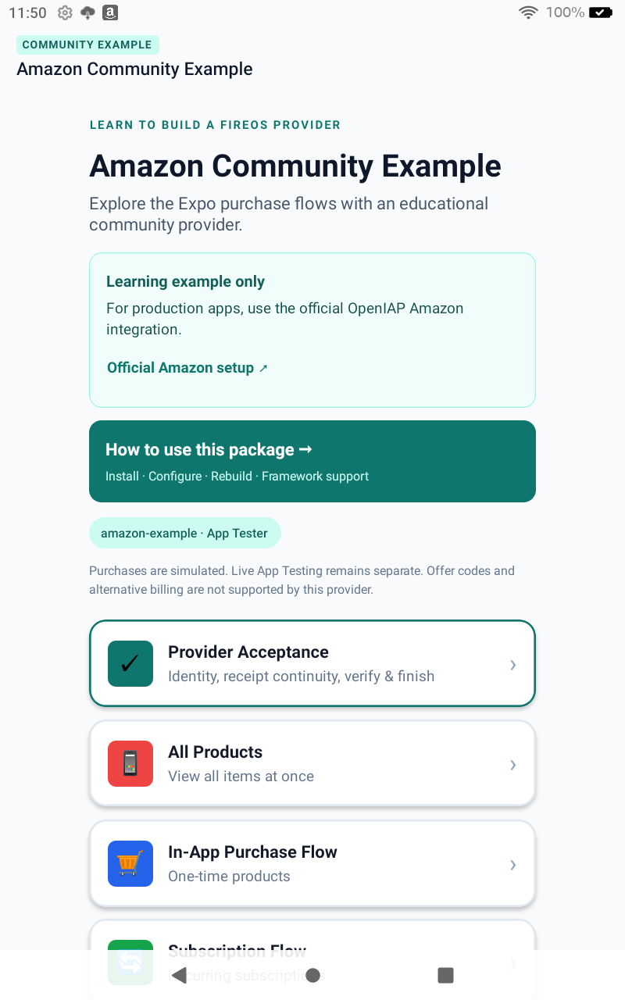
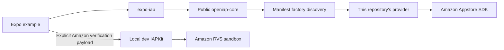
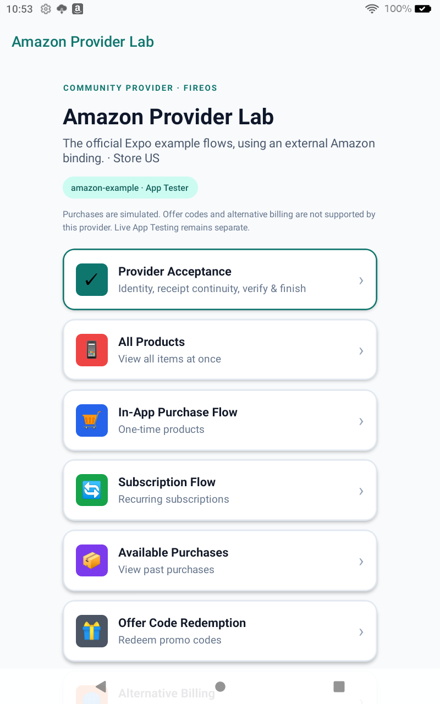
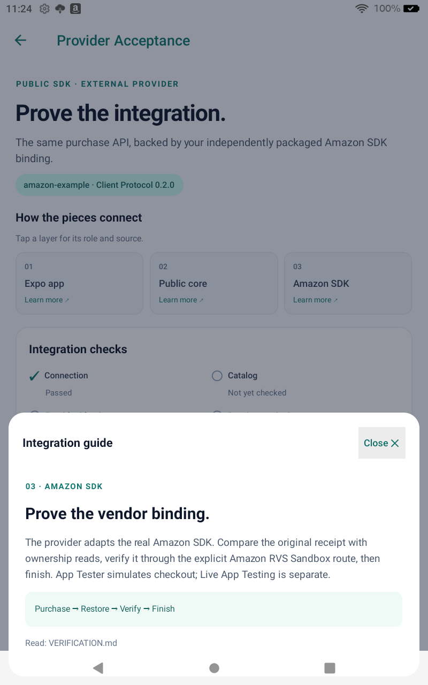
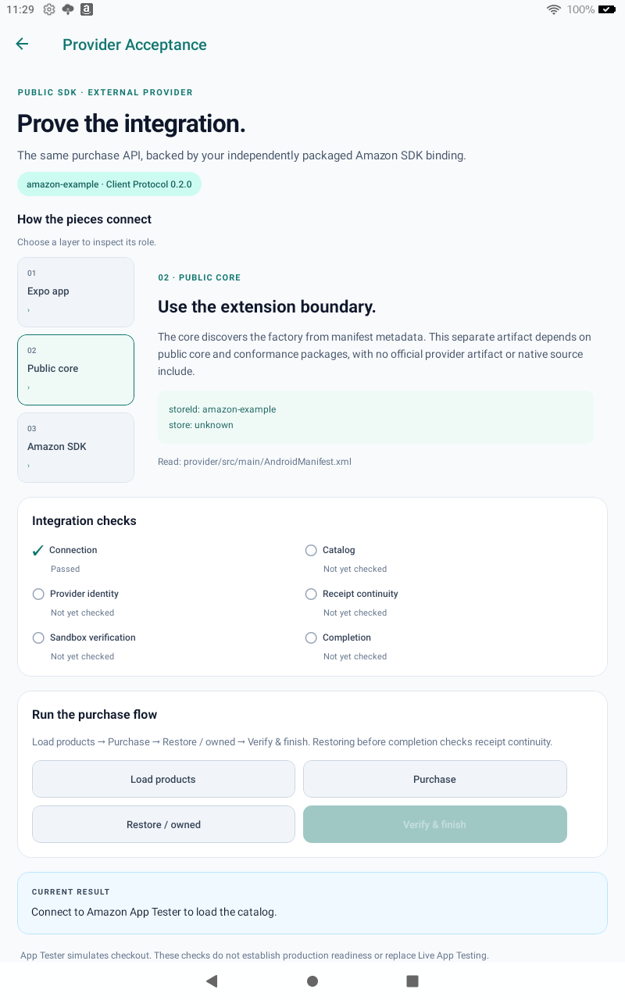
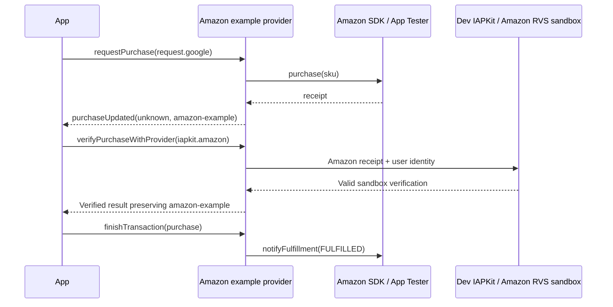
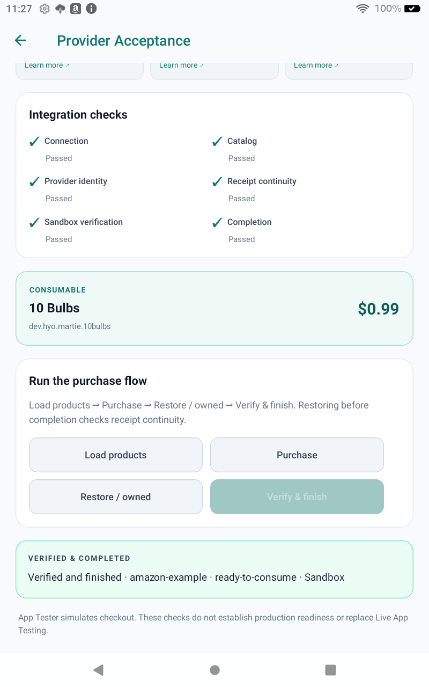

# OpenIAP Google Amazon community example

**For apps on FireOS, use the official OpenIAP Amazon integration.** Follow the [Amazon setup guide](https://openiap.dev/docs/setup/store/amazon) for your framework. The official Android artifact is [`io.github.hyochan.openiap:openiap-google-amazon`](https://central.sonatype.com/artifact/io.github.hyochan.openiap/openiap-google-amazon).

`openiap-google-amazon-community` is an **educational community package example for provider authors**. It demonstrates external packaging, discovery and verification through Client Protocol **0.2.0**. It is not the official FireOS package and is not recommended for production purchases.

The app keeps a `COMMUNITY EXAMPLE` badge in every screen header. Its home screen labels the learning-only purpose, links to the official Amazon setup and opens an [installation guide](docs/screenshots/community-package-guide.png).

**Start here:** [SDK compatibility](#can-i-use-it-before-pr-504-is-merged) → [Install and configure Expo](#install-this-example-package) → [Run the example](#prepare-the-pinned-sdk-inputs). In the app, tap **How to use this package** on the home screen.

## Can I use it before PR #504 is merged?

**Yes, with the pinned SDK/core builds used by this example.** The example runs Client Protocol 0.2.0 before merge by building its public Expo IAP and `openiap-core` inputs from [openiap-revision.txt](openiap-revision.txt). A merge is not required to run that source.

**Installing this package into a currently released SDK is not supported.** Released SDKs do not yet include this provider contract; the plugin checks Client Protocol 0.2 compatibility. [Prepare the pinned inputs](#prepare-the-pinned-sdk-inputs) first. A compatible official SDK/core release is required before this becomes a normal registry-only SDK installation.

## Does one package work in every framework?

**The verified package installation is Expo on Android/FireOS.** The package contains an Android AAR, its Maven metadata and an Expo config plugin. It supplies a store provider, not a replacement for each framework's OpenIAP SDK. Keep using that SDK's purchase API.

| Consumer               | Integration required                                                                                                    | This package's verification                                                                                         |
| ---------------------- | ----------------------------------------------------------------------------------------------------------------------- | ------------------------------------------------------------------------------------------------------------------- |
| Expo                   | Install the GitHub package, replace the `expo-iap` config plugin entry, then rebuild Android.                           | Registry install, tests, optimized build and separate Fire evidence recorded in [VERIFICATION.md](VERIFICATION.md). |
| React Native / Flutter | Use a compatible SDK, add the packaged Maven repository, set `openiapStore` and `openiapProvider`, and rebuild Android. | Not verified with this package.                                                                                     |
| KMP                    | Use the resolver plugin and the `provider` platform variant with a compatible SDK and the packaged Maven repository.    | Not verified with this package.                                                                                     |
| Godot                  | Add the provider repository and set `openiap/android_store` and `openiap/android_provider` for Android export.          | Not verified with this package.                                                                                     |
| .NET MAUI              | Add the provider repository and set `OpenIapStore` and `OpenIapProvider` with a compatible Android binding.             | Not verified with this package.                                                                                     |
| iOS / macOS            | This Android AAR has no Apple implementation.                                                                           | Unsupported by this package.                                                                                        |

Other Android frameworks can share the same native provider, but this Expo plugin does not configure them. Extract the package's `maven/` directory, add it to the app's Maven repositories and select `amazon-example` with `dev.openiap.providers:openiap-provider-amazon-example:0.0.1`. See the [provider selection source for PR #504](https://github.com/hyodotdev/openiap/blob/feat/google-pluggable-store-providers/packages/docs/src/pages/docs/guides/store-providers.tsx) for each SDK's configuration.

<details>
<summary>Example app preview</summary>



</details>

Use this example to:

- Build and discover an Android provider using public OpenIAP core artifacts and the store's native SDK.
- Follow purchase, restore, verification, and completion while preserving a custom provider identity and receipt.
- Run public provider conformance tests and check the Expo consumer in debug and optimized Android builds.

The Amazon binding is adapted from upstream OpenIAP. The separate repository tests external packaging and integration; it is not a second independently designed implementation or proof that the protocol is complete. See [scope and provenance](#scope-and-provenance).

GitHub Packages `0.0.1` passed a fresh registry installation, 177 consumer tests, typecheck and an optimized Android build. An earlier Appstore-installed Martie LAT build using `0.1.2`, with the same native AAR, connected and loaded three existing in-app products. Its subscription catalog was empty, so **LAT purchases, renewal, cancellation-before-expiry and server revocation remain unverified**. App Tester separately covers simulated purchase, cancellation, pending recovery and first-attempt monthly/yearly verification and completion. [VERIFICATION.md](VERIFICATION.md) records the boundaries.

The provider uses `storeId: 'amazon-example'` and `store: 'unknown'`. It does not depend on `openiap-google-amazon`, Google Play Billing, or Meta Horizon. The community distribution targets **GitHub Packages**, not npmjs.org or Maven Central.



## Install this example package

1. [Prepare the pinned Expo SDK and core inputs](#prepare-the-pinned-sdk-inputs); a released SDK cannot load this provider yet.
2. Configure GitHub Packages authentication and install the exact package below.
3. Replace the Expo plugin entry while keeping the SDK dependency and app-specific options.
4. Run `bunx expo prebuild --platform android` and `bunx expo run:android`. This adds native code; Expo Go and a JavaScript reload are insufficient.

The repository is named `openiap-google-amazon-community`. Its published installation name remains `@hyodotdev/openiap-provider-amazon-example` so existing consumers keep working. This example package contains the provider AAR, Maven dependency metadata, sources, and an Expo config plugin. It bundles no OpenIAP core, official store provider, application credentials, or consumer app. `provider-artifact.json` records its source commit, contract input, and AAR SHA-256.

Configure a GitHub classic token with `read:packages`, or a repository-authorized Actions token, outside the app. GitHub's npm registry requires authentication even for public packages. Put this in the consumer's ignored `.npmrc`:

```ini
@hyodotdev:registry=https://npm.pkg.github.com
//npm.pkg.github.com/:_authToken=${NODE_AUTH_TOKEN}
```

```sh
bun add --exact @hyodotdev/openiap-provider-amazon-example@0.0.1
```

Replace any existing `expo-iap` entry with the installed plugin in the consumer's Expo config. Keeping both is rejected because Expo runs its IAP plugin only once:

```js
plugins: ["@hyodotdev/openiap-provider-amazon-example"];
```

It selects `amazon-example`, derives the Maven version from the installed package, and adds the package's own `maven` directory. Rebuild the native app after installing or updating the provider. The registry token is used by the package manager, never by Gradle or the mobile app. See GitHub's [registry instructions](https://docs.github.com/en/packages/working-with-a-github-packages-registry/working-with-the-npm-registry).

Keep the existing application's package id, product catalog, purchase screens and compatible Expo IAP options. Pass those options to this plugin. It selects the community provider, replaces legacy store flags and disables local native-source mode. For Appstore-distributed builds, download that application's **Public Key** from Amazon Developer Console and keep its path in the configuration:

```js
plugins: [
  [
    "@hyodotdev/openiap-provider-amazon-example",
    {
      android: {
        amazon: { appstoreKey: "./keys/AppstoreAuthenticationKey.pem" },
      },
    },
  ],
];
```

The existing Expo IAP plugin copies this app-specific public key into Android assets on every prebuild. It belongs to the consumer application, not the community package. A missing or mismatched key prevents Amazon SDK authentication; see Amazon's [troubleshooting guide](https://developer.amazon.com/docs/appstore-sdk/appstore-sdk-troubleshooting.html).

This repository's consumer accepts the same path through `AMAZON_APPSTORE_KEY` when running prebuild. Leave it unset for App Tester simulation.

For LAT, keep the existing Amazon app and tester account. Use its registered catalog, including the subscription parent and term SKUs in product queries; only term SKUs are purchasable. Match verification to the registered RVS base SKU, rather than copying this reference's App Tester base. Production-RVS verification also needs the existing Amazon Shared Key on the developer backend. A new app or product catalog is not required.

## Prepare the pinned SDK inputs

Use these sibling directories:

```text
hyodotdev/
├── openiap/
└── openiap-google-amazon-community/
```

The current public registries do not yet contain this provider contract. Check out OpenIAP's pinned input revision from [openiap-revision.txt](openiap-revision.txt), or a compatible checkout of [PR #504](https://github.com/hyodotdev/openiap/pull/504). Preparation requires a clean OpenIAP checkout and rejects other Client Protocol minor versions.

`provider-artifact.json` records the actual input revision and core dependency; `openIapPinnedRevision` retains the CI pin separately. Packaging requires matching successful test inputs, AAR and report hashes. Publishing a different binary without retesting is rejected.

Requirements: Java 17, Android SDK 36 with NDK 27.1.12297006, Node.js, npm, Bun, and a Fire tablet with USB debugging. Configure `ANDROID_HOME` or an ignored `local.properties` with `sdk.dir`. Install the sibling OpenIAP checkout's build dependencies once:

```sh
cd ../openiap
bun install --frozen-lockfile --ignore-scripts
cd ../openiap-google-amazon-community
```

From this repository:

```sh
node scripts/prepare-openiap.mjs
cd example
bun install --ignore-scripts
bun run typecheck
bun run test
bunx expo prebuild --platform android --no-install
cd android
./gradlew -PreactNativeArchitectures=arm64-v8a,armeabi-v7a :app:assembleDebug
```

Preparation builds public core and conformance Maven artifacts into `.local/maven`, tests and packs this provider, and packs Expo from its frozen build inputs. It materializes the same two workspace links as OpenIAP's release packaging. Local development installs content-addressed tarballs; registry verification replaces the community tarball dependency with its exact GitHub Packages version and retains only the core fixture. Neither consumer includes native source projects.

For a consumer using the unreleased core fixture, pass its absolute Maven path to the installed plugin:

```js
[
  "@hyodotdev/openiap-provider-amazon-example",
  {
    openIapRepository: "/absolute/path/to/core-only-maven",
  },
];
```

### Publish, update, and reproduce a registry install

`package.json` owns the provider version used by the AAR and Expo plugin. Change it for every new distribution; published versions are immutable. Keep the compatible contract input in `openiap-revision.txt` and rerun provider conformance, lint, consumer tests, and the optimized build before publishing.

This educational package has its own version; it does not track OpenIAP or framework SDK versions. The renamed example starts at `0.0.1`, pinned explicitly above. Historical `0.1.1` and `0.1.2` distributions remain available; the `example` distribution tag keeps this reset from changing their `latest` channel.

1. Push the verified source and wait for **Verify example** to pass at that exact commit.
2. Create the immutable lightweight tag `community-provider-vVERSION` at that commit.
3. Dispatch **Publish and verify GitHub package** with that `expected_sha` and its successful `verification_run` ID.
4. On the first publication, open the package's GitHub settings and change visibility to **Public**. GitHub defaults new npm packages to Private; access inherited from a public repository does not change that visibility.
5. If the visibility gate failed before this change, rerun only the failed consumer job. Check the `registry-proof` artifact and job results before using the version.

The publisher accepts only a successful main push run at the exact tagged source. It publishes the tested tarball through Actions and checks the registry SHA-512. A separate fresh runner requires public package visibility, installs from GitHub Packages, checks all consumer tests and types, builds with R8, and compares the actual resolved AAR against the tested package. The proof records visibility, versions, source, binary digest, and factory retention; its workspace contains no provider source or local provider Maven artifact. Retries accept an existing version only when its integrity matches exactly.

Consumers pin an exact version, update that pin deliberately, and rebuild the native app. Roll back by restoring the previous dependency and lockfile and rebuilding. Package credentials belong in developer or CI configuration; never commit them or put them in Expo public environment values.

### Device and sandbox setup

Install and configure [Amazon App Tester](https://developer.amazon.com/docs/in-app-purchasing/iap-install-and-configure-app-tester.html). The credential-free [catalog fixture](example/amazon.sdktester.json) contains the five products used by the official comparison screens:

| SKU                           | Amazon type    | Period  |
| ----------------------------- | -------------- | ------- |
| `dev.hyo.martie.10bulbs`      | `CONSUMABLE`   | —       |
| `dev.hyo.martie.30bulbs`      | `CONSUMABLE`   | —       |
| `dev.hyo.martie.certified`    | `ENTITLED`     | —       |
| `dev.hyo.martie.premium`      | `SUBSCRIPTION` | Monthly |
| `dev.hyo.martie.premium_year` | `SUBSCRIPTION` | Yearly  |

The subscription terms share parent `dev.hyo.martie.premium.parent` and base `dev.hyo.martie.premium.base`. The fixture matches the catalog used for the recorded comparison. If `/sdcard/amazon.sdktester.json` already exists, back it up before installing this fixture and restore it after testing. This command replaces that catalog:

```sh
adb -s DEVICE push example/amazon.sdktester.json /sdcard/amazon.sdktester.json
```

Open App Tester → Appstore SDK APIs → IAP Items in JSON File and confirm all five entries. App Tester works with debug apps and simulates purchases. [Live App Testing](https://developer.amazon.com/docs/in-app-purchasing/iap-testing-overview.html) is a separate validation with an Appstore-distributed candidate.

```sh
adb -s DEVICE shell setprop debug.amazon.sandboxmode debug
adb -s DEVICE reverse --no-rebind tcp:8081 tcp:8082
adb -s DEVICE install -r example/android/app/build/outputs/apk/debug/app-debug.apk
adb -s DEVICE shell am start -n dev.openiap.provider.fireos.example/.MainActivity
```

In another terminal, run `cd example && bun start`. Metro uses host port 8082; the Android debug app reaches it through device port 8081. Preserve existing reverse rules and remove only mappings you create when finished.

## Compare the official example



The consumer copies OpenIAP’s official Expo Router example screens and shared UI from the pinned revision. It changes public package imports, provider selection, branding and the community verification adapter. [example/upstream-example.json](example/upstream-example.json) records the source and adaptations.

| Screen                           | Purpose in this reference                                                                                                    |
| -------------------------------- | ---------------------------------------------------------------------------------------------------------------------------- |
| All Products                     | Compare the same catalog view against the external Amazon binding.                                                           |
| In-App Purchase Flow             | Use the official purchase, verification, completion and retry flow.                                                          |
| Subscription Flow                | Inspect the official subscription UI and supported provider reads; a screen is not proof of the full subscription lifecycle. |
| Available Purchases              | Compare owned purchases and restore results.                                                                                 |
| Offer Code / Alternative Billing | Show unsupported capability for this provider without opening Google Play.                                                   |
| Provider Acceptance              | Inspect custom identity, unchanged restored receipt, Sandbox verification and consumable completion.                         |

Start with **Provider Acceptance**: Load products → Purchase → Restore / owned → Verify & finish. Connection and catalog are separate checks; restore before completion proves receipt continuity. Pending approval and failed verification grant no entitlement and remain unfinished.

The copied purchase and subscription flows default to server verification and fail closed when configuration is missing. Their official “None (Skip)” selector cannot bypass verification for `amazon-example`. The strict acceptance screen also requires a local development URL and a publishable key.

### Inspect the three integration layers

Tap **01 Expo app**, **02 Public core** or **03 Amazon SDK** in Provider Acceptance. Compact displays open a guide panel; displays at least 768 logical pixels wide show the selected explanation beside the menu. Both layouts read the same [tutorial data](example/src/utils/providerTutorial.ts); layout and interaction live in [ProviderTutorial.tsx](example/src/components/ProviderTutorial.tsx).

| Compact guide                                                    | Wide guide                                                 |
| ---------------------------------------------------------------- | ---------------------------------------------------------- |
|  |  |

These are actual Fire tablet captures. The wide capture uses a temporary display-density override; the original device settings were restored. It is layout evidence, not a separate device purchase run.

### Verify before finishing

The example deliberately requires a local **development** IAPKit server at `http://127.0.0.1:3100`. Configure Amazon RVS sandbox support on its dev project, then supply its publishable `openiap-kit_pk_…` key through the environment:

```sh
export EXPO_PUBLIC_IAPKIT_BASE_URL=http://127.0.0.1:3100
export EXPO_PUBLIC_IAPKIT_API_KEY=YOUR_DEV_PUBLISHABLE_KEY
adb -s DEVICE reverse --no-rebind tcp:3100 tcp:3100
cd example
bun start
```

Expo public environment values are bundled into the app. Never use a secret/admin key. This repository includes no server credentials or app signing keys.

**Verify & finish** sends an explicit Amazon payload to `verifyPurchaseWithProvider`, checks validity, product, sandbox environment, completion state, and `amazon-example` identity, then consumes the purchase through `finishTransaction`. In an application, grant the entitlement after verification and before completion.

Subscription checkout uses the term SKU; RVS returns the base or parent SKU. The verification adapter reads that mapping from the catalog fixture and requires the matching RVS product. Changing the catalog requires updating its subscription mapping too. SDK ownership and `autoRenewingAndroid` are not server renewal or expiry evidence; read Amazon RVS before granting access.

### Live App Testing requirements

A LAT candidate must use the package and catalog registered for that Amazon app, an Appstore installation, and production RVS. Set `EXPO_PUBLIC_AMAZON_RVS_SANDBOX=false` when building it; the default is `true` for App Tester. Keep IAPKit on a development deployment with the matching application identity and Amazon verification configuration. The Provider Acceptance screen deliberately remains a Sandbox check; use Subscription Flow for LAT verification.

Verify a fresh subscription, an accelerated renewal, cancellation while access remains valid, and expiry with access revoked. Record the store and RVS response for each state. An App Tester cancellation that removes local ownership while RVS Sandbox still returns `entitled` does not pass this lifecycle gate. See Amazon's [LAT for IAP](https://developer.amazon.com/docs/in-app-purchasing/iap-lat.html) and [accelerated subscriptions](https://developer.amazon.com/docs/app-testing/accelerated-subscriptions-introduction.html).



The device provider contract does not add a backend verification adapter. A backend must explicitly support the underlying store. `request.google` is the Android platform request binding even for this Amazon provider; the `store` enum alone cannot route a community receipt.



## Conformance and checks

```sh
./gradlew -PopenIapRepository="$PWD/.local/maven" \
  :provider:testDebugUnitTest :provider:lintRelease
```

The public `ProviderConformanceSuite` runs the actual provider and its production mappers. A Robolectric shadow replaces only Amazon SDK transport. It exercises required lifecycle, identity, errors, receipt continuity, completion, and declared pending-purchase behavior. This is automated simulation, not a sandbox purchase.

The provider also rejects Apple-only purchase and subscription inputs with exactly one canonical error event and no purchase. Community providers must deliver that event before returning or throwing a failure so event-based SDK callers can complete.

The generated report is `provider/build/reports/openiap/amazon-example.json`. [VERIFICATION.md](VERIFICATION.md) records observed results and remaining limits. Optional capabilities not declared by this provider are reported as not applicable. Passing this profile does not certify every Amazon subscription or server lifecycle.

## Native provider setup

The installed Expo plugin selects `store: "amazon-example"` and `provider: "dev.openiap.providers:openiap-provider-amazon-example:VERSION"`, using the installed package version. The Maven installation name also remains unchanged after the repository rename.

### Other frameworks

The same Android AAR can be connected to compatible React Native, Flutter, Godot, KMP and MAUI SDKs through their [store-provider configuration](https://openiap.dev/docs/guides/store-providers). Each app still needs its framework's OpenIAP SDK, the package's `maven` directory in its Maven repositories, and the store/provider pair above. The bundled config plugin automates **Expo only**; installing this JavaScript package does not automatically configure another framework.

Follow Amazon's [SDK integration requirements](https://developer.amazon.com/docs/in-app-purchasing/iap-implement-iap.html), including the existing app's public authentication key. The library manifest supplies factory discovery, early listener registration and the protected response receiver. Preserve its consumer R8 rules. This Android AAR supplies no iOS or Vega implementation.

Actual GitHub Packages installation, consumer tests and optimized-build verification cover Expo. They do not prove registry installation or device behavior in every framework. For ordinary FireOS apps, use the official integration linked at the top.

## Scope and provenance

The consumer screens, shared UI and inherited tests were copied from the official Expo example; the added acceptance screen checks the external-provider boundary. The Amazon binding and its regression tests were extracted and adapted from MIT-licensed OpenIAP at the input revision in [openiap-revision.txt](openiap-revision.txt). They compile against public contracts with a separate namespace, provider identity, Maven artifact, and consumer app.

The maintained official Amazon integration is [`openiap-google-amazon`](https://github.com/hyodotdev/openiap/tree/main/packages/google) and is recommended for FireOS apps. This repository is an educational community example for provider authors. See [LICENSE](LICENSE).
